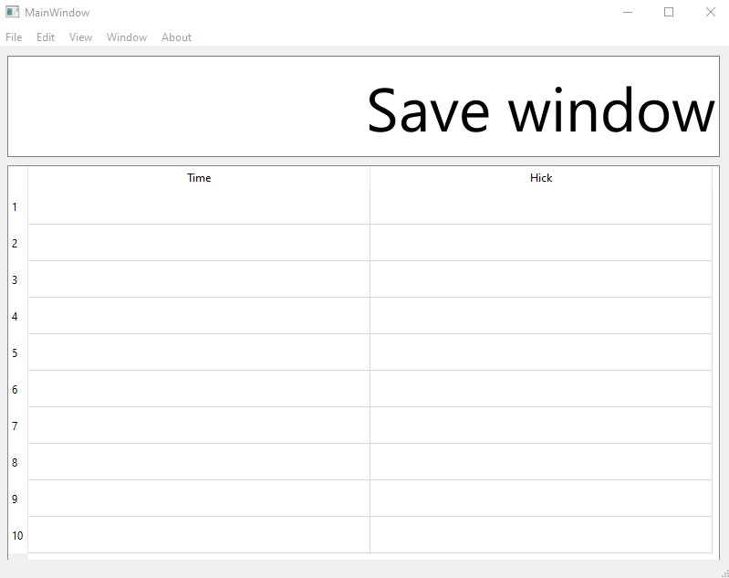
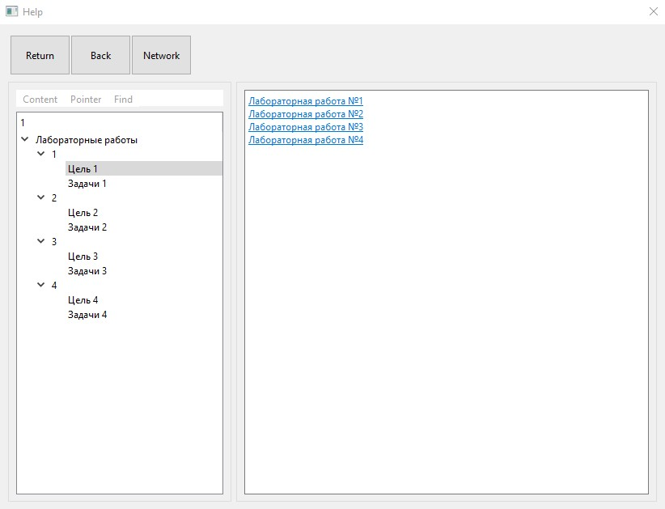
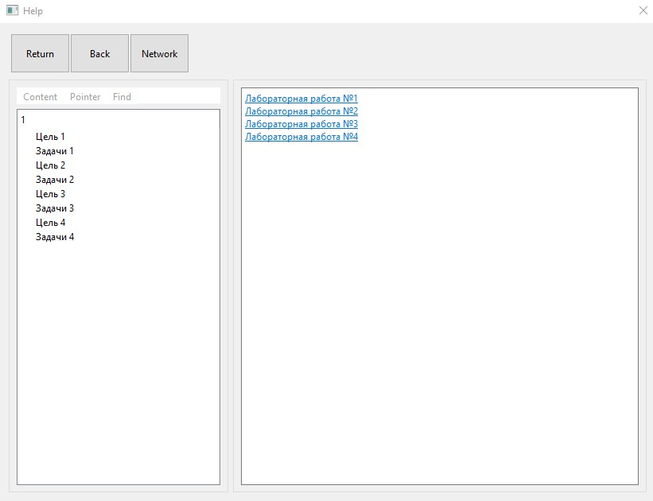
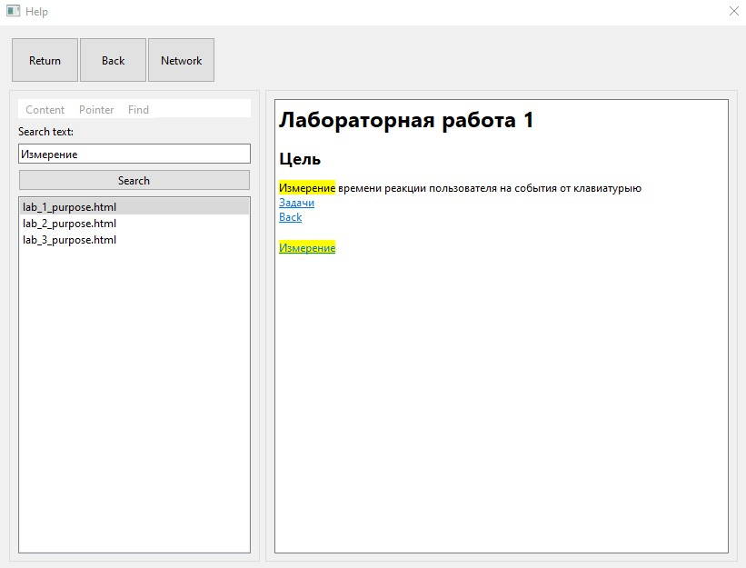

# Справочная система приложения
При выборе меню "Help" должна появиться информация о лабораторной работе. Предусмотрено общее описание работы, поиск информации по шаблону и посимвольный поиск. Справочная система содержит в себе гиперссылки и доступ к сети интернет.

Главное окно

Диалоговое окно при выборе подпункта "Content"

Диалоговое окно при выборе подпункта "Pointers"

Диалоговое окно при выборе подпункта "Find"

# Инструкция
Для вывода диалогового окна со справкой нажать на подпункт меню "Help". Для поиска необходимой информации выбрать пункт меню "Content" и нажать на соответствующий подпункт меню. Для вывода поиска по шаблону выбрать пункт "Pointers". Для вывода поиска по шаблону выбрать пункт меню "Find" и ввести искомый текст.

# Требования
Скачать и установить Qt Creator

# Клонирование репозитория
git clone https://github.com/nKadykov/interactive_systems_3
